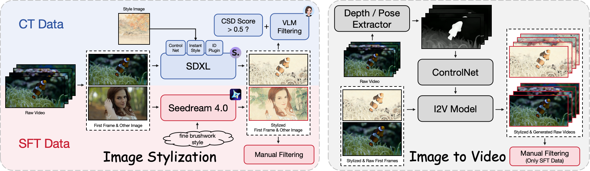
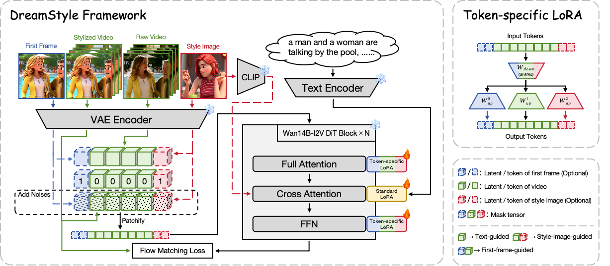

# <div align="center">DreamStyle: A Unified Framework for Video Stylization</div>
<div align="center">
    <a href="https://lemonsky1995.github.io/" target="_blank">Mengtian Li</a><sup>✉</sup>,
    <a href="https://openreview.net/profile?id=~Jinshu_Chen2" target="_blank">Jinshu Chen</a>,
    <a href="https://openreview.net/profile?id=~Songtao_Zhao1" target="_blank">Songtao Zhao</a><sup>‡</sup>,
    <a href="https://wanquanf.github.io/" target="_blank">Wanquan Feng</a>,
    <a href="https://openreview.net/profile?id=~Pengqi_Tu1" target="_blank">Pengqi Tu</a>,
    <a href="https://scholar.google.com/citations?user=9rWWCgUAAAAJ" target="_blank">Qian He</a>
    <br>
    Intelligent Creation, ByteDance
</div>
<br>
<div align="center">
    [<a href="https://lemonsky1995.github.io/dreamstyle/" target="_blank">Project Page</a>]
    [<a href="https://arxiv.org/abs/2601.02785" target="_blank">arXiv</a>]
</div>

## Abstract
Video stylization, an important downstream task of video generation models, has not yet been thoroughly explored. Its input style conditions typically include text, style image, and stylized first frame. Each condition has a characteristic advantage: text is more flexible, style image provides a more accurate visual anchor, and stylized first frame makes long-video stylization feasible. However, existing methods are largely confined to a single type of style condition, which limits their scope of application. Additionally, their lack of high-quality datasets leads to style inconsistency and temporal flicker. To address these limitations, we introduce DreamStyle, a unified framework for video stylization, supporting (1) text-guided, (2) style-image-guided, and (3) first-frame-guided video stylization, accompanied by a well-designed data curation pipeline to acquire high-quality paired video data. DreamStyle is built on a vanilla Image-to-Video (I2V) model and trained using a Low-Rank Adaptation (LoRA) with token-specific up matrices that reduces the confusion among different condition tokens. Both qualitative and quantitative evaluations demonstrate that DreamStyle is competent in all three video stylization tasks, and outperforms the competitors in style consistency and video quality.

## Overview


Data Curation Pipeline. We propose generating the training data with two key steps: image stylization followed by image to video. Considering the characteristics of different image stylization techniques, we construct a CT dataset and a SFT dataset, where SDXL (equipped with ControlNet, InstantStyle, and ID plugin) and Seedream 4.0 are selected as their stylization models, respectively. For image to video, we utilize ControlNets to enhance the motion consistency between the generated stylized and raw videos. To ensure the data quality, we additionally apply automatic filtering for CT data and manual filtering for SFT data.


Overview of DreamStyle Framework. DreamStyle is built on the Wan14B-I2V model, integrating the text and raw-video conditions through the cross-attention and image channels of the base model, while the first-frame and style-image conditions serve as additional frames concatenated to the start and end of the frame sequence. We train it using a standard flow matching loss and a token-specific LoRA that contributes to distinguishing different condition tokens.

## Latest News

- Jan 7, 2026: We release the <a href="https://arxiv.org/abs/2601.02785" target="_blank">Technical Report</a> of DreamStyle

## Todo List

- [x] Release technical report
- [ ] Release inference code
- [ ] Release models
- [ ] Release training code

## Citation
If you find DreamStyle useful in your research, please kindly cite our paper:
```bibtex
@misc{li2026dreamstyle,
    title={DreamStyle: A Unified Framework for Video Stylization}, 
    author={Mengtian Li and Jinshu Chen and Songtao Zhao and Wanquan Feng and Pengqi Tu and Qian He},
    year={2026},
    eprint={2601.02785},
    archivePrefix={arXiv},
    primaryClass={cs.CV},
    url={https://arxiv.org/abs/2601.02785}, 
}
```
